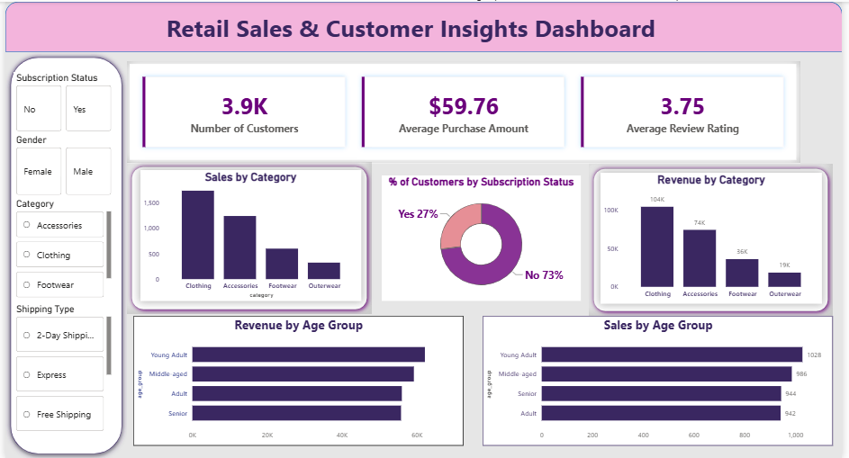

# 📊 Retail Sales & Customer Insights Dashboard

## 📌 Project Overview

This project analyzes retail customer shopping behavior using **SQL, PostgreSQL, and Power BI**. The objective is to transform raw retail data into meaningful business insights through SQL analysis and an interactive Power BI dashboard.

The dashboard enables users to explore customer purchasing patterns, revenue trends, product performance, subscription behavior, and demographic insights using interactive filters and key performance indicators (KPIs).

---

## 🎯 Project Objectives

- Analyze customer purchasing behavior and revenue trends.
- Identify high-performing product categories.
- Compare spending patterns across different customer segments.
- Develop an interactive dashboard to support data-driven decision-making.

---

## 🛠️ Tools & Technologies

- SQL
- PostgreSQL
- Power BI

---

## 📂 Dataset

- **Dataset:** Customer Shopping Behavior Dataset
- **Source:** Public dataset provided through a YouTube tutorial resource
- **Records:** 3,900
- **Columns:** 18

The dataset includes customer demographics, purchase amounts, product categories, review ratings, payment methods, shipping types, subscription status, discounts, and purchase history.
---

## 📈 Dashboard Features

### KPI Cards
- Total Customers
- Total Revenue
- Average Purchase Amount
- Average Review Rating

### Interactive Slicers
- Gender
- Category
- Season

### Visualizations
- Revenue by Product Category
- Sales by Product Category
- Revenue by Age Group
- Subscription Status Distribution

---

## 📝 SQL Analysis

The SQL queries answer key business questions, including:

- Total revenue by gender
- Customers spending above the average purchase amount
- Top-rated products
- Average purchase amount by shipping type
- Subscriber vs. non-subscriber spending comparison
- Discount usage analysis
- Customer segmentation based on previous purchases
- Top-selling products within each category
- Repeat buyer subscription analysis
- Revenue contribution by age group

---

## 📷 Dashboard Preview

---

## 🎯 Skills Demonstrated

- SQL Query Writing
- PostgreSQL Database Management
- Power BI Dashboard Development
- Data Visualization
- KPI Reporting
- Business Insights Generation
- Interactive Dashboard Design

---

## 🚀 How to Use

1. Download the `.pbix` file from this repository.
2. Open it using **Microsoft Power BI Desktop**.
3. Use the interactive slicers to explore different customer segments and sales trends.

---

## 👩‍💻 Author

**Sachi Godbole**

- **GitHub:** https://github.com/Sachi-Godbole
- **LinkedIn:** https://www.linkedin.com/in/sachi-godbole/
